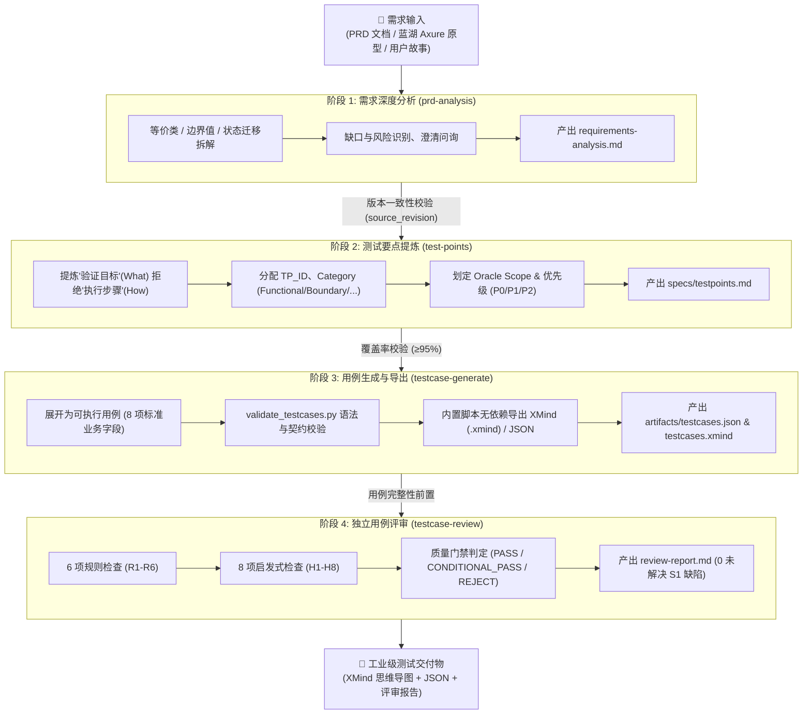

# TestSpec SOP 🚀

[](https://opensource.org/licenses/MIT)
[](https://www.python.org/)
[]()
[]()

> **面向 AI Coding Agent 的工程化端到端功能测试用例标准操作流程（SOP）与 Agent Skills 套件**  
> *Industrial-grade Functional Test Specification Pipeline & Agent Skills for SDETs*

---

## 📖 项目简介 (Overview)

**TestSpec SOP** 是一套专为资深测试开发（SDET）及质量工程设计的 **AI Agent 规范化测试流水线**。

在让 LLM / AI Coding Agent（如 Claude Code, Codex, Google Antigravity, Cursor 等）编写测试用例时，业内常面临以下痛点：
- ❌ **直接一步生成用例**：跳过需求边界与风险梳理，导致模型严重依赖“幻觉”，漏测核心分支；
- ❌ **用例颗粒度粗、步骤泛化**：充斥着“点击按钮，验证页面展示正常”等不可执行的伪用例，断言缺少可判定的业务依据（Oracle）；
- ❌ **难以溯源与缺乏门禁**：无法清晰映射需求与用例覆盖度，缺少闭环的质量评审门禁；
- ❌ **格式碎片化**：不同模型输出的字段、层级随心所欲，无法直接导入团队现有的用例管理平台或转换为评审思维导图。

**TestSpec** 通过严谨的**四阶段递进式工程流水线**，将“需求深度分析 → 测试要点提炼 → 8 字段结构化用例展开与 XMind 导出 → 14 维度独立交叉评审”全流程严格解耦与标准化，确保 AI 产出的测试用例具备极高的可执行性、可验证性与工业级交付标准。

> 📌 **测试边界声明**：本流程专注于**功能测试用例**（涵盖主流程、业务规则、边界值、异常流、角色权限、状态迁移与功能间交互）；API 文档与接口定义可作为需求事实证据，但本流水线不产出独立的接口测试、安全渗透、性能或兼容性测试用例。

---

## 🔄 核心流水线架构 (Core Pipeline)



---

## 📊 四阶段职责与门禁对照 (Stages Breakdown)

| 流程 Skill | 核心职责与解决的问题 | 关键输入 | 主要输出产物 | 出口质量门禁 |
|---|---|---|---|---|
| **`prd-analysis`** | **需求说清楚了吗？哪些地方影响测试？**<br/>运用等价类、边界值、状态迁移等方法深度拆解需求，识别逻辑漏洞与风险。 | PRD 文档、蓝湖 Axure 原型链接、用户需求片段 | `requirements.md`<br/>`requirements-analysis.md` | 需求来源可追溯；风险、边界、异常与待确认项已清晰区隔 |
| **`test-points`** | **具体要验证哪些行为？（What）**<br/>从深度分析中提炼纯粹的验证要点清单，坚持“只描述验证目标，绝不写操作步骤”。 | `requirements-analysis.md` | `specs/testpoints.md` | 每个测试点拥有唯一 `TP_ID`、明确优先级 (P0/P1/P2)、Oracle 状态与需求引用 |
| **`testcase-generate`** | **如何把测试点转化为可执行用例？（How）**<br/>将测试点展开为完整测试用例，通过内置 Python 脚本生成思维导图。 | `testpoints.md`、需求上下文 | `artifacts/testcases.json`<br/>`artifacts/testcases.xmind` | 严格包含 8 大业务字段；TP 覆盖率 ≥95%；通过 `validate_testcases.py` 自检；预期结果可判定 |
| **`testcase-review`** | **用例是否完整、可执行、无遗漏？**<br/>站在独立审查视角，针对用例质量执行 14 维度交叉验证，作为流程最终质量把关。 | `testcases.json`<br/>`testpoints.md`<br/>需求分析材料 | `review-report.md` | 完成 14 项检查；**无未解决的 S1 缺陷**；明确给出 `review_gate: PASS` |

---

## ✨ 核心特性与设计规范 (Key Features)

### 1. 严格的 8 大业务字段契约
所有生成的用例格式统一，完美契合企业级测试管理平台（Jira, TestRail, Metersphere 等）：
- **模块** (`module`)：业务顶层系统或功能大类。
- **子模块** (`submodule`)：功能子分类。
- **测试名称** (`name`)：场景名称，表达具体的业务验证场景。
- **前置条件** (`preconditions`)：账号状态、数据底料、前置流程等。
- **测试数据** (`test_data`)：明确的输入参数、测试账号格式或数值边界。
- **操作步骤** (`steps`)：按序号编号、具体可复现的用户交互动作。
- **预期结果** (`expected_results`)：有客观业务依据的可观察判定结果（Oracle）。
- **优先级** (`priority`)：`p0` (核心冒烟), `p1` (高优功能), `p2` (常规/边界/异常)。

### 2. 原生 XMind 思维导图自动生成
- 内置轻量 Python 生成器（`skills/testcase-generate/scripts/generate_xmind.py`），**无任何第三方商业软件或 GUI 依赖**，直接构建标准 `.xmind` 压缩包与 XML 节点。
- 导图层级：`模块 → 子模块 → 场景名称`（叶子省略模块前缀），场景名称下挂载 `前置条件`、`测试数据`、`操作步骤`，`预期结果` 作为 `操作步骤` 的子节点直接内嵌展示。
- 自动为 `p1` 附加 1 号图标、`p2` 附加 2 号图标，`p0` 保持清晰纯净。

### 3. 14 维度交叉 Review 质量门禁
评审模块包含两大检测体系，杜绝低质量用例混入评审会：
- **规则检查 (R1-R6)**：字段完整性、步骤可执行性、独立前置校验、数据明确性、Oracle 有效性、双向追溯性。
- **启发式检查 (H1-H8)**：边界与异常覆盖、角色权限隔离、状态机闭环、逆向思维验证、隐式依赖防漏等。
- **质量门禁（Gate）**：未解决 S1（严重阻塞）缺陷为 0 时方可通过。

### 4. 蓝湖 / Axure 原型直连解析
- 内置 `skills/prd-analysis/scripts/direct_extract_axure.py`，支持直接解析蓝湖 Axure 原型分享链接。
- 自动提取页面文本结构、交互状态说明及图片资源，形成标准化需求事实输入，解决图片未辨认导致的需求盲区问题。

### 5. 全链路上下文与版本锁协议 (Context Protocol)
- 所有阶段产物严格向下传播 `source_revision`，保证需求变更时自动发现用例过期或脱节，防止错误版本流入测试环节。

---

## 🗂️ 仓库目录结构 (Repository Layout)

```text
.
├── README.md                           # 项目主说明文档
├── AGENTS.md                           # AI Agent 行为准则与 SDET 专家思维规范
└── skills/                             # 核心 Agent Skills 套件
    ├── prd-analysis/                   # [阶段 1] 需求分析技能
    │   ├── SKILL.md                    # 技能工作流定义与提示词
    │   ├── references/                 # 分析模式、蓝湖输入规范、审问闭环协议
    │   ├── scripts/                    # 蓝湖 Axure 直连提取脚本 (direct_extract_axure.py)
    │   └── tests/                      # 单元测试集
    ├── test-points/                    # [阶段 2] 测试点设计技能
    │   ├── SKILL.md                    # 技能工作流定义
    │   └── references/                 # 测试点设计规范、TP 命名规则、模板
    ├── testcase-generate/              # [阶段 3] 用例生成与导出技能
    │   ├── SKILL.md                    # 技能工作流定义
    │   ├── scripts/                    # 原生 XMind 生成器 (generate_xmind.py)
    │   ├── references/                 # 用例设计原则、粒度划分标准、JSON 契约
    │   └── tests/                      # 用例校验与 XMind 生成测试
    ├── testcase-review/                # [阶段 4] 用例独立评审技能
    │   ├── SKILL.md                    # 技能工作流与门禁判定定义
    │   ├── references/                 # 14 维度评审准则 (R1-R6, H1-H8)
    │   └── review-report-template.md   # 标准评审报告模板
    └── _testspec-shared/               # 跨技能公共底座与协议
        ├── references/                 # 上下文协议、命名契约、输出契约、反思协议
        ├── scripts/                    # 契约与用例校验脚本 (validate_testcases.py 等)
        └── tests/                      # 跨阶段上下文集成测试
```

---

## 🚀 快速上手 (Quick Start)

### 方式一：作为 Agent Skills 使用（推荐）

TestSpec 原生遵循通用 Agent 技能规范，可直接挂载至支持 Agent Skills 的 AI 工具中（如 Claude Code, Codex, Google Antigravity, Cursor 等）：

#### 标准执行步骤：

1. **执行阶段 1：需求分析**
   ```text
   使用 $prd-analysis 读取这个需求：
   https://lanhuapp.com/...（或粘贴 PRD 文档 / 用户需求片段）
   ```
2. **执行阶段 2：提取测试点**
   ```text
   使用 $test-points，从需求分析提炼精简测试要点清单
   ```
3. **执行阶段 3：生成测试用例并导出 XMind**
   ```text
   使用 $testcase-generate，生成 8 字段用例并默认导出 XMind
   ```
4. **执行阶段 4：执行用例独立评审**
   ```text
   使用 $testcase-review，完成 14 项 Review 并查看评审门禁
   ```

Review 通过后，`artifacts/testcases.json` 与导出的 `testcases.xmind` 即为最终交付物；`review-report.md` 是最终质量门禁记录。

#### ↩️ 智能回退规则 (Fallback Rules)：
- 需求、验收条件或来源不清楚：回到 `prd-analysis` 补充。
- 测试点缺失、重复或粒度不合适：回到 `test-points` 调整。
- 用例字段、步骤、预期或方法选择有问题：回到 `testcase-generate` 修正。
- Review 发现 S1 级严重问题：修复后重新 Review，严禁直接带病放行。

---

### 方式二：直接使用内置 CLI 工具

TestSpec 内置了开箱即用的实用 Python 命令行脚本，纯标准库无沉重依赖：

#### 1. 蓝湖 Axure 原型直连解析
```bash
python3 skills/prd-analysis/scripts/direct_extract_axure.py \
  --url "https://lanhuapp.com/web/#/item/project/detail?tid=...&pid=..." \
  --output-dir "./output/prd_extracted"
```

#### 2. 测试用例自检与格式校验
```bash
python3 skills/_testspec-shared/scripts/validate_testcases.py \
  --input artifacts/testcases.json \
  --testpoints specs/testpoints.md
```

#### 3. 将 JSON 用例一键生成 XMind 思维导图
```bash
python3 skills/testcase-generate/scripts/generate_xmind.py \
  --input artifacts/testcases.json \
  --output artifacts/testcases.xmind \
  --title "功能测试用例思维导图"
```

---

## 🧪 自动化测试与质量保障 (Verification)

本仓库内置了严谨的白盒与契约自动化测试套件：

```bash
# 1. 运行全部单元测试 (29 tests 全部通过)
python3 -m unittest discover -s skills/prd-analysis/tests
python3 -m unittest discover -s skills/testcase-generate/tests
python3 -m unittest discover -s skills/_testspec-shared/tests

# 2. 运行技能输出契约与依赖校验
python3 skills/_testspec-shared/scripts/validate_skill_contracts.py

# 3. 运行 Evals 评估集自检
python3 skills/_testspec-shared/scripts/validate_evals.py
```

---

## 📐 产物契约与规范 (Contracts)

### 1. 测试用例 JSON Schema 核心字段示例
```json
{
  "testcases": [
    {
      "case_id": "TC_AUTH_LOGIN_001",
      "tp_id": "TP_AUTH_LOGIN_001",
      "module": "用户认证",
      "submodule": "密码登录",
      "name": "正确输入已激活手机号与密码登录成功",
      "priority": "p0",
      "preconditions": "1. 账号已注册且处于正常激活状态；\n2. 客户端网络连接正常。",
      "test_data": "手机号: 13800000000, 密码: Password123!",
      "steps": "1. 打开登录页面；\n2. 输入手机号与密码；\n3. 点击'立即登录'按钮。",
      "expected_results": "1. 接口返回登录成功 Token；\n2. 客户端跳转至首页；\n3. 顶部导航栏正确展示用户昵称与头像。"
    }
  ]
}
```

### 2. XMind 导图节点结构展示
```text
功能测试用例 (Root Topic)
 └── 用户认证 (Module)
      └── 密码登录 (Submodule)
           └── 正确输入已激活手机号与密码登录成功 [p0] (Test Name)
                ├── 前置条件
                │    └── 1. 账号已注册且正常激活...
                ├── 测试数据
                │    └── 手机号: 13800000000, 密码: Password123!
                └── 操作步骤
                     ├── 1. 打开登录页面...
                     ├── 2. 输入手机号与密码...
                     ├── 3. 点击'立即登录'按钮...
                     └── 预期结果
                          └── 1. 接口返回登录成功 Token；2. 客户端跳转至首页...
```

---

## 🤝 贡献指南与 SDET 准则 (Contributing & Principles)

在贡献或基于本 SOP 二次开发时，请严格遵守 [AGENTS.md](AGENTS.md) 约定的核心工程原则：
1. **先想清楚再动手**：不盲目猜测需求，出现歧义主动提出审问清单。
2. **能简单就别复杂**：坚持最小可用原则，拒绝过度设计与冗余流程。
3. **只改该改的内容**：严格保护被测系统与环境，不擅自更改底层生产逻辑。
4. **断言必须精准有据**：每条用例预期结果必须对应用户可感知的业务 Oracle。

欢迎提交 Issue 或 Pull Request 共同完善测试工程化标准！

---

## 📄 开源许可证 (License)

本项目遵循 [MIT License](https://opensource.org/licenses/MIT) 开源许可证。
